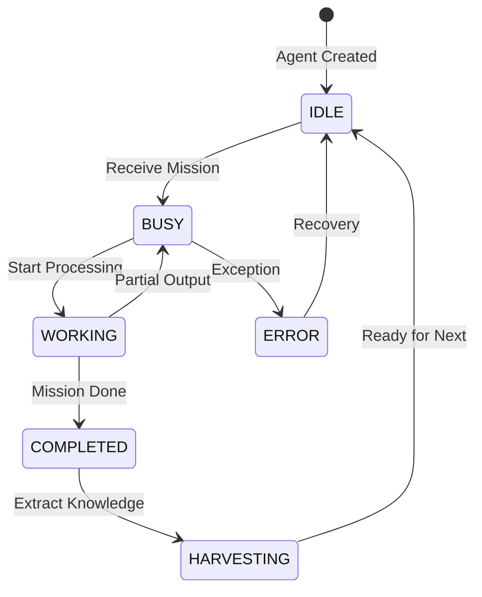

# 🏗️ PSI Engine - Architecture

> โครงสร้างและ architecture ของ Self-Improvement Engine

---

## 📊 System Overview

```
┌─────────────────────────────────────────────────────────────────────┐
│                         PSI Engine                                   │
│  ┌─────────────────────────────────────────────────────────────┐    │
│  │                    Flask Backend (app.py)                     │   │
│  │  ┌─────────────┐  ┌─────────────┐  ┌─────────────┐          │   │
│  │  │   Mission   │  │   Agent     │  │   Learning  │          │   │
│  │  │   Manager   │  │   Spawner   │  │   Loop      │          │   │
│  │  └──────┬──────┘  └──────┬──────┘  └──────┬──────┘          │   │
│  └─────────┼────────────────┼────────────────┼──────────────────┘   │
│            │                │                │                       │
│  ┌─────────▼────────────────▼────────────────▼──────────────────┐   │
│  │                    PTY Manager (pty_manager.py)               │   │
│  │  ┌───────────┐  ┌───────────┐  ┌───────────┐                 │   │
│  │  │  Agent 1  │  │  Agent 2  │  │  Agent 3  │                 │   │
│  │  │   (PTY)   │  │   (PTY)   │  │   (PTY)   │                 │   │
│  │  └───────────┘  └───────────┘  └───────────┘                 │   │
│  └─────────────────────────────────────────────────────────────────┘│
│                                                                      │
│  ┌─────────────────────────────────────────────────────────────┐    │
│  │                    ChromaDB (Vector Storage)                  │   │
│  │  ┌─────────────┐  ┌─────────────┐  ┌─────────────┐          │   │
│  │  │  Knowledge  │  │   Lessons   │  │   Context   │          │   │
│  │  │  Collection │  │  Collection │  │  Collection │          │   │
│  │  └─────────────┘  └─────────────┘  └─────────────┘          │   │
│  └─────────────────────────────────────────────────────────────────┘│
└─────────────────────────────────────────────────────────────────────┘
```

---

## 🔄 Agent Lifecycle



---

## 📁 File Structure

```
PSI-Engine/
├── app.py                   # Flask main
├── pty_manager.py           # Terminal management
├── config.py                # Configuration
│
├── agents/
│   ├── base_agent.py        # Base agent class
│   ├── researcher.py        # Research agent
│   └── executor.py          # Execution agent
│
├── tools/
│   ├── search.py            # RAG search
│   ├── web_search.py        # Web search
│   └── code_runner.py       # Code execution
│
├── knowledge/
│   ├── harvester.py         # Knowledge extraction
│   └── indexer.py           # ChromaDB indexing
│
├── static/                  # Frontend assets
├── templates/               # HTML templates
└── chroma_db/               # Vector database
```

---

## 🔌 Key Components

### 1. PTY Manager
- จัดการ pseudo-terminals สำหรับ agents
- Handle buffering และ output collection
- Track idle time ของแต่ละ terminal

### 2. Agent Spawner
- สร้าง AI agents ตามความต้องการ
- Assign missions ให้ agents
- Monitor agent status

### 3. Learning Loop
- Harvest knowledge จาก completed missions
- Update ChromaDB
- Generate lessons learned

### 4. RAG Search
- Semantic search ใน knowledge base
- Context retrieval สำหรับ missions
- Similar problem matching

---

## 🗄️ Database Schema (ChromaDB)

### Knowledge Collection
| Field | Type | Description |
|-------|------|-------------|
| id | string | Unique ID |
| content | string | Knowledge content |
| source | string | Source mission |
| created_at | datetime | Creation time |
| embedding | vector | Semantic embedding |

### Lessons Collection
| Field | Type | Description |
|-------|------|-------------|
| id | string | Unique ID |
| problem | string | Problem description |
| solution | string | Solution applied |
| outcome | string | Result |
| embedding | vector | Semantic embedding |

---

## 📝 Notes

- ใช้ Claude CLI เป็น AI backend
- ChromaDB ไม่ต้อง setup server แยก
- PTY ต้องระวังเรื่อง platform compatibility
