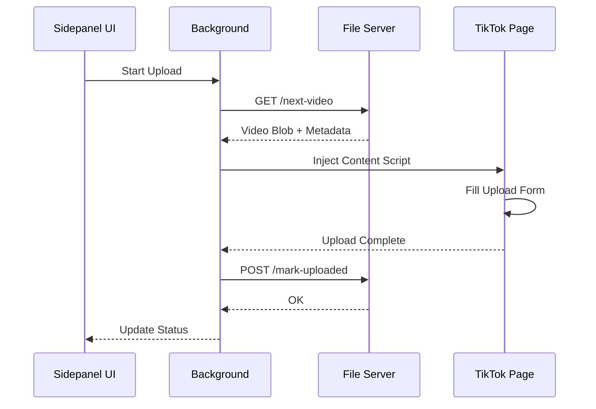

# 🏗️ TikTok Uploader - Architecture

> โครงสร้างและ architecture ของ TikTok Auto-Uploader

---

## 📊 System Overview

```
┌─────────────────────────────────────────────────────────────┐
│                     BROWSER (Chrome)                         │
│  ┌─────────────────────────────────────────────────────┐    │
│  │           Chrome Extension (Manifest V3)             │    │
│  │  ┌───────────────┐  ┌───────────────┐               │    │
│  │  │   Sidepanel   │  │   Background  │               │    │
│  │  │   (UI/React)  │  │   (Service    │               │    │
│  │  │               │  │    Worker)    │               │    │
│  │  └───────┬───────┘  └───────┬───────┘               │    │
│  └──────────┼──────────────────┼────────────────────────┘    │
└─────────────┼──────────────────┼─────────────────────────────┘
              │                  │
              │ HTTP API         │ Content Scripts
              ▼                  ▼
┌─────────────────────────────┐  ┌─────────────────────────────┐
│     Node.js File Server     │  │     TikTok Web Page         │
│  ┌───────────────────────┐ │  │  ┌───────────────────────┐  │
│  │   Express Server      │ │  │  │   Upload Form         │  │
│  │   (Port 3001)         │ │  │  │   Automation          │  │
│  └───────────────────────┘ │  │  └───────────────────────┘  │
│  ┌───────────────────────┐ │  └─────────────────────────────┘
│  │   Video Folders       │ │
│  │   /videos/folder1/    │ │
│  │   /videos/folder2/    │ │
│  │   /videos/Uploaded/   │ │
│  └───────────────────────┘ │
└─────────────────────────────┘
```

---

## 🔄 Data Flow

### Upload Flow



---

## 📁 File Structure

```
TikTok-Uploader/
├── extension/
│   ├── manifest.json        # Extension config
│   ├── sidepanel.html       # UI HTML
│   ├── sidepanel.js         # UI Logic
│   ├── background.js        # Service Worker
│   ├── content.js           # TikTok page automation
│   └── styles.css           # Styling
│
├── file-server/
│   ├── server.js            # Express server
│   ├── config.json          # Folder configs
│   └── package.json         # Dependencies
│
└── videos/
    ├── folder1/             # Video source 1
    ├── folder2/             # Video source 2
    └── Uploaded/            # Processed videos
```

---

## 🔌 API Endpoints

| Method | Endpoint | Description |
|--------|----------|-------------|
| GET | `/status` | Server health check |
| GET | `/folders` | List configured folders |
| GET | `/next-video` | Get next video (round-robin) |
| POST | `/mark-uploaded` | Move video to Uploaded/ |
| GET | `/pending-count` | Count remaining videos |

---

## 🎯 Key Components

### 1. Sidepanel (UI)
- แสดง status การ upload
- Control start/stop
- แสดง pending count

### 2. Background (Service Worker)
- จัดการ lifecycle
- Coordinate ระหว่าง UI และ content script
- Call file server API

### 3. Content Script
- Inject เข้า TikTok page
- Fill upload form automatically
- Handle upload completion

### 4. File Server
- Serve video files
- Round-robin folder selection
- Track uploaded videos

---

## 📝 Notes

- ใช้ Manifest V3 (ไม่ใช้ Manifest V2)
- Server ต้องรันก่อน extension ถึงจะใช้งานได้
- Videos ถูกย้ายไป Uploaded/ หลัง upload สำเร็จ
