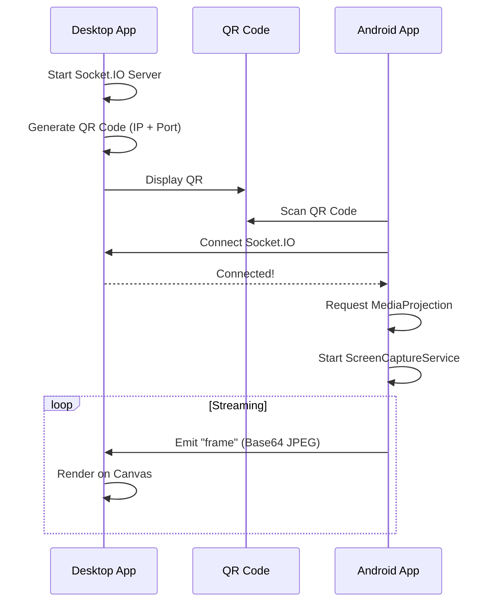

# 🏗️ TitanMirror - Architecture

> โครงสร้างและ architecture ของ Screen Mirroring App

---

## 📊 System Overview

```
┌─────────────────────────────────────────────────────────────────────┐
│                    ANDROID DEVICE                                    │
│  ┌─────────────────────────────────────────────────────────────┐    │
│  │                    TitanMirror App                           │    │
│  │  ┌─────────────────┐  ┌─────────────────┐                   │    │
│  │  │   MainActivity  │  │  MirrorActivity │                   │    │
│  │  │   (QR Scan)     │  │   (Capture UI)  │                   │    │
│  │  └────────┬────────┘  └────────┬────────┘                   │    │
│  │           │                    │                             │    │
│  │  ┌────────▼────────────────────▼────────┐                   │    │
│  │  │        ScreenCaptureService          │                   │    │
│  │  │   (MediaProjection + ImageReader)    │                   │    │
│  │  └────────────────────┬─────────────────┘                   │    │
│  │                       │                                      │    │
│  │  ┌────────────────────▼─────────────────┐                   │    │
│  │  │           SocketManager              │                   │    │
│  │  │      (Socket.IO Client)              │                   │    │
│  │  └────────────────────┬─────────────────┘                   │    │
│  └───────────────────────┼──────────────────────────────────────┘   │
└──────────────────────────┼──────────────────────────────────────────┘
                           │
                           │ WiFi (Socket.IO)
                           │ Events: frame, device_info, remote_log
                           │
┌──────────────────────────┼──────────────────────────────────────────┐
│                    DESKTOP (PC)                                      │
│  ┌───────────────────────▼──────────────────────────────────────┐   │
│  │                  TitanMirror Desktop                          │   │
│  │  ┌─────────────────┐  ┌─────────────────┐                    │   │
│  │  │   Electron      │  │   Express +     │                    │   │
│  │  │   (Main Process)│  │   Socket.IO     │                    │   │
│  │  └────────┬────────┘  └────────┬────────┘                    │   │
│  │           │                    │                              │   │
│  │  ┌────────▼────────────────────▼────────┐                    │   │
│  │  │              Renderer                 │                    │   │
│  │  │   (Canvas + UI + Presentation Mode)  │                    │   │
│  │  └──────────────────────────────────────┘                    │   │
│  └──────────────────────────────────────────────────────────────────┘│
└─────────────────────────────────────────────────────────────────────┘
```

---

## 🔄 Connection Flow



---

## 📁 File Structure

```
TitanMirror/
├── TitanMirror-Desktop/
│   ├── main.js              # Electron + Socket.IO server
│   ├── package.json
│   └── renderer/
│       ├── index.html       # UI layout
│       ├── renderer.js      # Canvas rendering
│       └── styles.css       # Styling
│
└── TitanMirror-Android/
    └── app/src/main/
        ├── java/.../
        │   ├── MainActivity.kt       # QR scanning
        │   ├── MirrorActivity.kt     # Mirror UI
        │   ├── ScreenCaptureService.kt # Capture + emit
        │   └── SocketManager.kt      # Socket.IO client
        │
        └── res/                      # Resources
```

---

## 🔌 Socket.IO Events

### Client → Server (Android → PC)
| Event | Data | Description |
|-------|------|-------------|
| `device_info` | `{name, model, resolution}` | Device registration |
| `frame` | Base64 JPEG string | Screen frame |
| `remote_log` | `{level, message}` | Debug logs |

### Server → Client (PC → Android)
| Event | Data | Description |
|-------|------|-------------|
| `touch` | `{x, y, action}` | Touch event (future) |
| `key` | `{keyCode}` | Key event (future) |

---

## ⚙️ Performance Tuning

| Parameter | Value | Impact |
|-----------|-------|--------|
| Resolution | 480p | Lower = faster, higher = quality |
| FPS | 25 | Capped for stability |
| JPEG Quality | 50% | Balance size/quality |
| ImageReader Buffer | 5 | Prevent frame drops |
| Capture Delay | 1.5s | Wait for MediaProjection init |

---

## 📝 Key Learnings

1. **Android 14**: `startForeground()` ต้องเรียกทันทีใน `onStartCommand()`
2. **Intent Parcelable**: API 33+ ต้องใช้ explicit class
3. **MediaProjection**: ต้อง delay 1.5s ก่อน start capture

---

## 🔮 Future Features

- [ ] Remote control via Accessibility Service
- [ ] Audio streaming
- [ ] Multi-device support
- [ ] Recording to file
